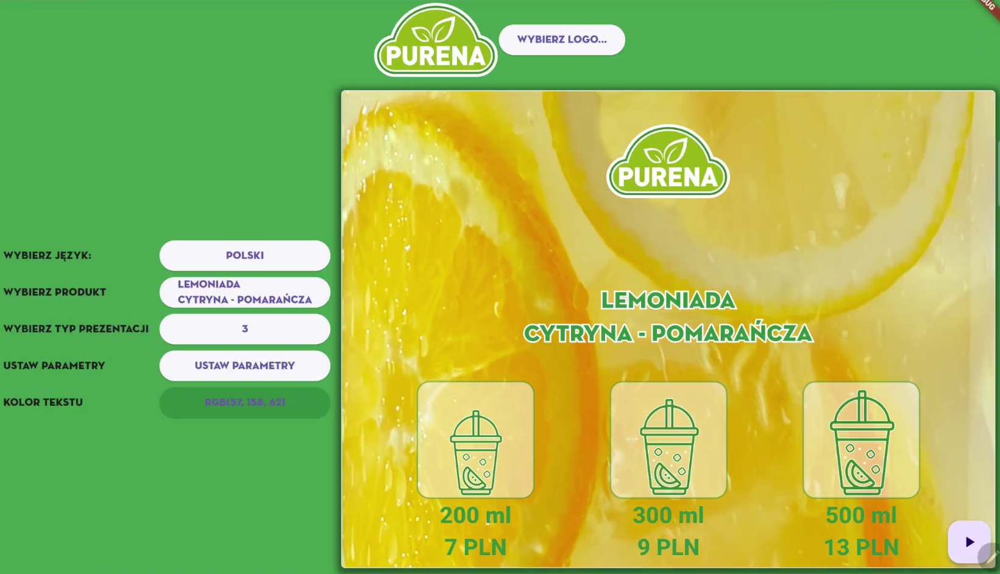
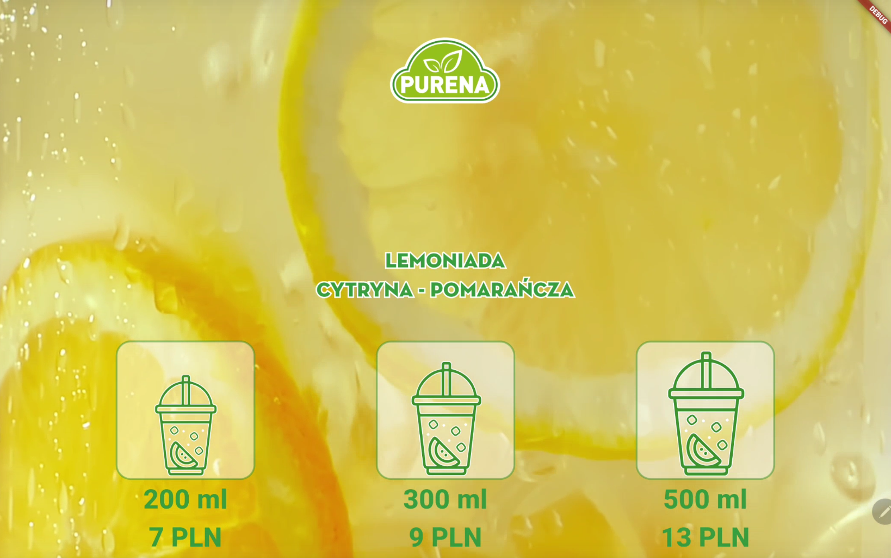

# Purena Lemo+ App

## Overview

Purena Lemo+ is a showcase Flutter application designed for displaying various juice products at
marketing
events and conferences. It offers functionalities such as setting product prices, choosing the type
of product, and selecting the presentation style. The app is ideal for businesses looking to present
and adjust their product offerings dynamically in a visually appealing format.

## Features

- **Product Customization**: Users can easily set and update the prices and types of juice products.
- **Presentation Styles**: Choose different presentation styles to best suit the event and audience.
- **Dynamic Updates**: Make real-time changes during events to adapt to audience feedback or
  promotional strategies.

## Screenshots

Below are some screenshots of the Purena Lemo+ app in action:

## Installation

To install Purena Lemo+ on your device, follow these steps:

1. Download the installation package from the provided link.
2. Run the installer and follow the on-screen instructions.
3. Once installed, open the app and configure your initial product settings.

## Usage

To use the app effectively:

1. **Product types**: Press the 'Choose Product' button to select new product.
2. **Set Prices**: Click on parameters button to adjust prices and sizes.
3. **Change Presentation**: Select the presentation type to toggle between different visual styles.

## Support

For any technical support or queries, please contact szczepanos@gmail.com.